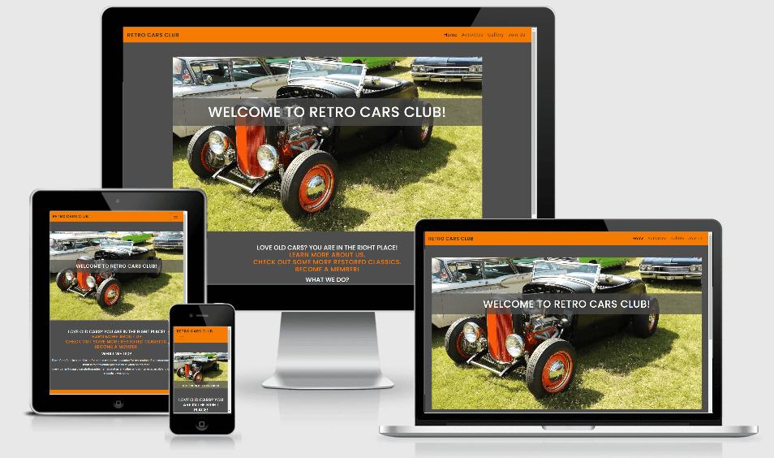

# Rerto Cars Club

<!--- add links to all RCCs --->

[Live link here.](https://dimitar-4.github.io/ms-project1-rcc/) 

This is a website for classic cars enthusiasts. It is design to be responsive
on all sorts of devises so that the users can easily navigate their way to the
information they need and also provided with more options such as getting to
know different activities of the club and signing up.

---

## User Experience (UX)
 
### User Stories

1. First time visitors:
 * As a classic car enthusiast I want to easily learn about a place for restored cars.
 * As a fan of all types of vehicles I want to see photos of restored old cars.
 * As a retro car owner I want to find others that share the same 
 experience and passion for drivig old car models.
 * As a car photographer I'm interested in learning about event where I can make 
 some great photos. 
 
2. Frequent visitors:
 * As a classic cars enthusiast I'm interested in starting my own restoration project 
 and I'm looking for support from more experienced in this field.
 * As a retro cars restorator I want to find information about meetings and discussions 
 on ideas and ways to work on my projects. 
 * As an fan of all types of vehicles I want to frequently watch extraordinary photos of 
 classic cars. Find information about car shows or exhibitions where I can see them. Learn something 
 interesting about the cars of the previous century.
 * As a proffesional photographer I want to develop a work opportunities by making photo sessions 
 for different events or clients.

### Wireframes

1. [Home](https://raw.githubusercontent.com/dimitar-4/ms-project1-rcc/37c393ade5338e0b037ffd57892d22f19331835f/assets/wireframes/home.png)
2. [Activities](https://raw.githubusercontent.com/dimitar-4/ms-project1-rcc/37c393ade5338e0b037ffd57892d22f19331835f/assets/wireframes/activities.png)
3. [Gallery](https://raw.githubusercontent.com/dimitar-4/ms-project1-rcc/37c393ade5338e0b037ffd57892d22f19331835f/assets/wireframes/gallery.png)
4. [Join Us](https://raw.githubusercontent.com/dimitar-4/ms-project1-rcc/37c393ade5338e0b037ffd57892d22f19331835f/assets/wireframes/join.png)

---
## Features

The website is responsive on all tested devices. 

1. The Home page gives clear idea of the website's purpose. What is it about.
2. The Activities page is giving more focused information about the user options.
3. The Gallery page is providing visual data for the website's purpose.
4. The Join Us page is giving opportunity to further develop owner-client relations.   

---
## Technologies Used

 - HTML
 - CSS
 - Bootstrap v4.5.2 
    * Bootstrap is used throughout all pages for style and responsiveness. 
 - Font Awesome 
    * Used to add icons to the Activities page and social media links in the footer.
 - Balsamiq 
    * Used to design the basic look for the project.
 - Google Fonts 
    * "Roboto" and "Poppins" fonts are used in the project.
 - jQuery 
    * Added with Bootstrap so that the navbar is responsive.
 - Git 
    * Used for version control by Gitpod's terminal commit to Git and push to GitHub.
 - GitHub 
    * GitHub is where the project is stored after being pushed from Git.
 - Material Design - Color Tool 
    * Used to create the color scheme used in the project.
 - Tiny png 
    * Used to resize the images that are used for the project.

---
## Testing

### User Experience Testing

By entering the website you see the welcoming titles on the menu bar as well as on the hero image 
combined with the home page image it gives clear idea for the purpose of the site. Answers the 
search of those users that are interested in this field.

The site is giving multiple choices from where to navigate throughout the different pages and is easy to see and understand what to 
expect when entering the desired page. All pages and content is easily accessible.

The page showing the different events is well structured. Gives clarity about specific information for the users.

The gallery page is easy to access and provides users with the visual content of their interest.

The page that gives opportunity to sign up is reachable from different locations in the website 
and answers the search for the new and frequent visitors to reach their personal or proffesional goal.

The signing form responds with warning messages if it is not filled correctly. 

* The project was shared with family and friend to be tested on different devises as well as to collect data 
about their actual user experience. There was a positive feedback and conformation for the user experience testing above.

### Code Testing

All four pages of code were runned in W3C Markup Validator for HTML and W3C CSS Validator for CSS validators.  

- The HTML code was tested [here!](https://validator.w3.org/)
- The CSS code was tested [here!](https://jigsaw.w3.org/css-validator/)

No issues or errors were shown. The testing of the code was done by direct input method.

### Device Testing

The project was tested on various devices to search for any problems with responsiveness 
and how it is visually presented on different screen sizes.

Devices tested:
- Mobile Devices
   * Xiomi Note 5
   * Samsung Galaxy A51
   * Huawei P20 Pro
   * Huawei Mate 10 Pro

- Laptop & Desktop Monitors
   * Lenovo ThinkPad 20Q6
   * Acer Aspire 5 A515-51G
   * Acer B7 series-B277(Desktop Monitor)

   No problems were shown on tested devices.

### Problems

When testing the responsiveness there was an issue found with the heading standing on the hero image in the home page.
The problem is on devices with screen width under 300px. The heading is going down and covers the text bellow the image.
Could't make it to remain on the hero image as intended.     

---
## Deployment

To deploy the website to GitHub Pages from its GitHub repository, the following steps were taken:

1. Log into GitHub.
2. From the list of repositories on the screen, select ms-project1-rcc.
3. From the menu items near the top of the page, select Settings.
4. Scroll down to the GitHub Pages section.
5. Under Source click the drop-down menu labelled None and select Master Branch 
6. When Master Branch is selected press the Save button on the right and the page is automatically refreshed, the website is now deployed.
7. Scroll back down to the GitHub Pages section to retrieve the link to the deployed website.

---
## Credits

### Content

- All the text in the content of the website is written by me.
   * The slogan in the footer is from commonly used stickers on classic cars like [this one!](https://s.cdnmpro.com/660674058/p/m/4/tablou-nothing-is-awesome-than-a-classic-car~6314.jpg)
- Bootstrap grid was used throughout all pages of the project and code for components like:
   * Navigation bar, cards, carousel, form.  
- The code for the events in the Activities page is taken from the "Whiskey Drop" project from the Code Institute's studying program.
- The code for the footer's social links is taken from the "Love Running" project from the Code Institute's studying program.
- The media query code for the form responsiveness in the Join Us page is from the "ucd-resume" project from the Code Institute's studying program.

All of the code not written by the developer in Retro Cars Club's website is further developed with HTML and CSS languages so it can fit the design of the project. 

### Media

* All the photos used in the project were taken by the me (the developer).

### Acknowledgements

* The inspiration for this project came from my own passion for all types of vehicles.
* Akshat Garg (Mentor) - for the advices and feedback on my project.
* Slack platform - for just being there with so many answers.
